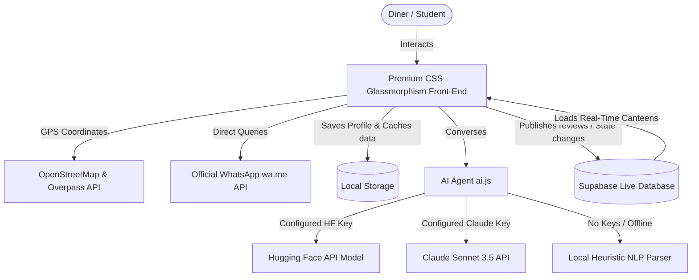

# 🍲 MessMate AI Premium

[](https://supabase.com)
[](https://huggingface.co)
[](https://openstreetmap.org)
[](https://messmate-ai.vercel.app)
[]()

**MessMate AI Premium** is a real-time, full-stack, AI-powered food discovery, diet recommendation, and smart ordering platform designed specifically for students and local diners.

🌐 **Live Demo Link:** [messmate-ai.vercel.app](https://messmate-ai.vercel.app)

Tired of walking to a canteen only to find it crowded, expensive, or sold out of your favorite food? MessMate AI bridges the gap between hungry students and local kitchen owners. It combines location-aware GPS tracking, real-time database state sync, custom dietary planning, and instant WhatsApp integration into a premium, hyper-responsive interface.

---

## 🚀 Key Features

### 🧠 1. MessMate Intelligence (AI Agent Tab)
* **Conversational AI Partner:** Ask about diet plans, budget constraints, or crowd updates. Supported by Claude API, Hugging Face endpoints, and a robust **Offline AI fallback simulator**.
* **Real-time Context Feeding:** The AI reads live availability data from surrounding canteens and details from your Diet Profile to answer queries with pinpoint accuracy.
* **Smart Side-by-Side Comparison Engine:** Generates interactive comparison grids right inside your chat box.
* **🎙️ Voice Search:** Supports speech-to-text queries using the browser's built-in **Web Speech API** (`en-IN` localized).

### 📍 2. Live GPS & OpenStreetMap Discover Tab
* **Interactive Geolocation:** Locate yourself instantly with a single tap or search any neighborhood (powered by **Nominatim Geocoding**).
* **Live Restaurant Extraction:** Query actual eating outlets within a 2km radius using the **Overpass API** directly from OpenStreetMap servers.
* **Real-time Status Tracking:** Quick indicators display rating stars, distances, budget levels, open/closed times, and crowd densities.
* **Visual Menus & Reviews:** Expand cards to inspect item quantities, live availability statuses (Available, Running low, Sold out), and post community reviews with star ratings.

### 💬 3. Smart WhatsApp Ordering Tab
* **Official WhatsApp Connection:** Order meals or check status via pre-drafted templates routed directly to the mess owners via `wa.me`.
* **Automated Templates:** Quick options for asking about today's menu, reserving a seat, querying crowd status, or asking about home delivery.
* **One-Click Dispatch:** Automatic text creation with active preview panel, manual copy options, and fast-track click triggers.

### 👤 4. Custom AI Diet Profile
* **Dietary Tuning:** Toggle between *Pure Vegetarian*, *Veg + Non-Veg*, or *Anything*.
* **Budget Limits:** Save your maximum price per meal to restrict recommendation lists.
* **Waiting Tolerances:** Indicate if you are crowd-averse so the platform hides busy environments.
* **Automatic Filter Syncing:** Synchronizes instantly, altering the AI agent’s system guidelines and the Discover Tab results.

### 🔥 5. Interactive Flash Deals & Simulator
* **15% Off Flash Deals:** The system automatically picks an open kitchen daily to offer an exclusive discount, complete with a bouncing high-attention banner and one-click focus animation.
* **Dynamic Environment Fluctuations:** Realistic internal simulator updates crowd densities and dish availability statuses dynamically (every 30 seconds) to replicate busy peak hours.

---

## 🛠️ Architecture & Data Flow



---

## 📂 Codebase Breakdown

* 📂 **`index.html`**: Structure of the premium multi-tab dashboard. Incorporates floating offer components, modern structural sections, forms, and CDN scripts.
* 📂 **`style.css`**: Complete design system with customizable CSS properties (`--primary`, `--glass-bg`, etc.). Incorporates a premium dark mode, smooth hover micro-animations, glassmorphic card layouts, custom badges, scrollbars, and responsiveness.
* 📂 **`app.js`**: Core controller logic. Manages geolocation, Nominatim geocoding, Overpass restaurant discovery, local fallbacks, daily flash deals, offline storage caching, custom filters, and periodic crowd state simulations.
* 📂 **`ai.js`**: AI conversation engine. Coordinates Claude and Hugging Face API payloads, implements structured markdown converters, handles voice speech recognition pipelines, and supports the local heuristic NLP simulator.
* 📂 **`whatsapp.js`**: WhatsApp messaging orchestrator. Handles custom template generation, auto-draft previews, copying mechanisms, and URL-dispatching triggers.
* 📂 **`supabase.js`**: Synchronizes live canteen states and menu details with a cloud-hosted relational DB using the Supabase Javascript Client SDK.
* 📂 **`data.js`**: Holds premium baseline restaurant data, and controls local browser storage caching.

---

## ⚙️ Setup & Configuration

### Prerequisites
To run the project, you only need a modern web browser. No complex node builds are required!

### 1. Database Setup (Supabase)
The application is pre-configured to interact with a database. To set up your table:
1. Create a table named `messes` in your **Supabase Project**.
2. Add the following schema fields:
   * `id` (int8, primary key)
   * `name` (text)
   * `area` (text)
   * `distance` (text)
   * `price` (numeric)
   * `rating` (numeric)
   * `type` (text - `veg` or `both`)
   * `isOpen` (boolean)
   * `crowd` (text - `busy` or `quiet`)
   * `phone` (text)
   * `menu` (jsonb array of items: `[{"item": "Rice", "available": "yes"}]`)
   * `reviews` (jsonb array of review objects: `[{"rating": 5, "text": "Yum!"}]`)
3. Open `supabase.js` and input your keys:
   ```javascript
   const SUPABASE_URL = "https://your-project-id.supabase.co";
   const SUPABASE_ANON_KEY = "your-anon-api-key";
   ```

### 2. AI Key Integration
Open `ai.js` to add your intelligence keys:

* **Hugging Face (Recommended Free Option):**
  1. Generate a free token at [Hugging Face Settings](https://huggingface.co/settings/tokens).
  2. Input the key and target text model:
     ```javascript
     const HUGGINGFACE_API_KEY = "hf_your_key_here";
     const HUGGINGFACE_MODEL = "google/flan-t5-small"; // or your preferred text generation model
     ```

* **Claude Sonnet API (Direct Key Option):**
  1. Create a key in your Anthropic Console.
  2. Add it to `ai.js`:
     ```javascript
     const CLAUDE_API_KEY = "sk-ant-your-key-here";
     ```

* *Note: If no keys are specified, MessMate AI operates in high-intelligence **Offline Simulator Mode**, dynamically creating plans, cheap lists, comparisons, and restaurant recommendations completely locally!*

---

## 🌐 Live Deployment & Local Setup

### ⚡ Live Demo
You can check out the production-grade deployed version of the app directly here:
🔗 **[messmate-ai.vercel.app](https://messmate-ai.vercel.app)**

### 💻 Running the App Locally
If you prefer to host it locally, simply run a development server:

Using Python:
```bash
python -m http.server 8000
```
Using Node:
```bash
npx serve .
```

Navigate to `http://localhost:8000` in your web browser.

---

## 🎨 Premium Theme Options

MessMate AI comes equipped with a custom-engineered color design system. Users can toggle between **Premium Dark Glassmorphism** (Neon purples, transparent backdrops, glowing outlines) and **Sleek Light Mode** (Clean, soft light backdrops, elevated dark indicators) at the tap of a button. Settings are automatically remembered across sessions.

---

## 🤝 Contributing

Contributions make the open-source community amazing! 

1. Fork the project.
2. Create your Feature Branch (`git checkout -b feature/AmazingFeature`).
3. Commit your changes (`git commit -m 'Add some AmazingFeature'`).
4. Push to the Branch (`git push origin feature/AmazingFeature`).
5. Open a Pull Request.

---

## 📄 License
Distributed under the MIT License. See [LICENSE](LICENSE) for details.

*Crafted with ❤️ by the MessMate AI Dev Team.*
